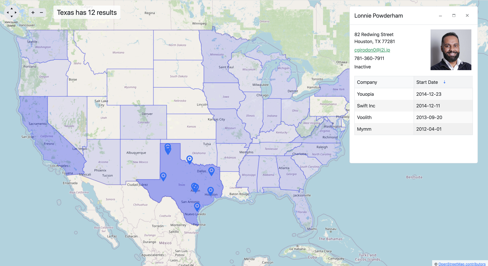

# ml-kendo-map

A React application that demonstrates the KendoReact Map component working with MarkLogic geospatial data:

- On load, uses MarkLogic faceted search results to display a heat map using a KendoReact Map shapes layer of U.S. states.
- On a U.S. state click, uses a MarkLogic geospatial point search to retrieve marker results based on the state's GeoJSON polygon coordinates.
- On a marker click, retrieves a MarkLogic document and displays it in a KendoReact Window (that includes a simple Data Grid).



## Requirements

- MarkLogic Server 10+
- Node.js 16+ and npm 8+

## Setup

1. If needed, edit `config.js` for your MarkLogic environment.

2. In a new terminal, install the project dependencies from the project root using npm:
```
cd ml-kendo-map
npm install
```
This will install dependencies for the setup script, proxy server, and React UI. You can also install dependencies separately by running `npm install` from each subdirectory.

3. From the project root, run the setup script:
```
node setup
```
This will set up your MarkLogic Server (create databases, a REST server, a user, etc.) and load the application documents. 

After setup, you can view your MarkLogic Server configuration in the Admin UI (http://localhost:8001) and the loaded documents in Query Console (http://localhost:8000/qconsole).

## Run the middle tier 

1. From the project root, run the Node.js Express proxy server, which is the middle tier between the React application and the MarkLogic Server:
```
node server
```

## Run the UI 

1. In a new terminal, run the React application from the `ui` directory:
```
cd ml-kendo-map/ui
npm start
```

2. Open the React application in your browser: http://localhost:3000
